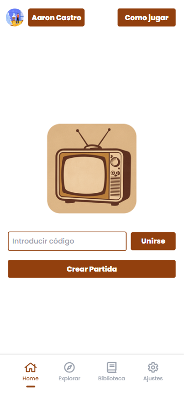

<!-- PROJECT LOGO -->
 

    

  <h3 align="center">TVMatch</h3>

   

        TVMatch es una aplicación destinada a poner de acuerdo a aquellos que quieren ver una serie de televisión pero no son capaces de coincidir en su decisión. Únete con tus amigos o familiares y ¡deslizad!
    

     
     
     

## Sobre el proyecto

  

 

    TVMatch es una PWA disponible para todo tipo de dispositivos. Disfruta eligiendo con los tuyos la serie que vais a ver a continuación. Seleccionad las plataformas de streaming con los que contais, elegid que solo aparezcan vuestros géneros favoritos, o seleccionad el modo para niños para disfrutar de las series recomendadas para toda la familia.

 
 
 

  
  

 

  

 
 

  
  

 
 

  

## Comenzar

Todo lo que necesitas para empezar a disfrutar de TVMatch

### Prerrequisitos

Asegurate de tener docker instalado y listo para poder montar el contenedor:

* [Docker](https://www.docker.com)

### Instalación

Clona el repositorio, utiliza el comando "docker-compose up" desde la carpeta TVMatch en la sección PROJECTS y ¡disfruta!

## Contact

Aaron Castro - aaroncasstroarias@gmail.com

Github - https://github.com/aaroncxsstro
